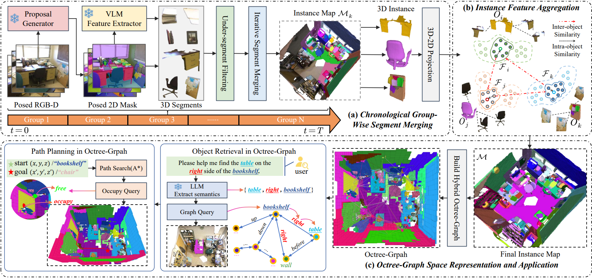

<h2 align="center">Open-Vocabulary Octree-Graph for 3D Scene Understanding</h2>

<p align="center">Zhigang Wang1*, Yifei Su*, Chenhui Li*, Dong Wang, Yan Huang, Bin Zhao, Xuelong Li</p>

<h5 align="center">Accepted to ICCV2025</h5>

<div align=center>
    
</div>

Given an RGB-D scan sequence and a reconstructed point cloud, we employ a  chronological group-wise merging method to integrate 2D masks into complete 3D instances, achieving strong performance in 3D zero-shot semantic segmentation and instance segmentation. Additionally, we propose an efficient adaptive octree-graph for representing instance occupation details, supporting various downstream tasks, e.g, instance retrieval and path planning.


### 1. Environment Setup

#### 1.1 Basic Dependencies

```bash
conda create -n ovgraph python=3.10
conda activate ovgraph

# PyTorch installation
pip install torch==2.1.2 torchvision==0.16.2 torchaudio==2.1.2 --index-url https://download.pytorch.org/whl/cu118

# pytorch3d installation
conda install -c fvcore -c iopath -c conda-forge fvcore iopath
cd 3rdparty
git clone https://github.com/facebookresearch/pytorch3d.git
cd pytorch3d && pip install -e .
cd ..

# faiss installation
conda install -c pytorch faiss-cpu=1.7.4 mkl=2021 blas
```

Install torch-scatter and flash-attn:

```bash
pip install "https://data.pyg.org/whl/torch-2.1.0%2Bcu118/torch_scatter-2.1.2%2Bpt21cu118-cp310-cp310-linux_x86_64.whl"
pip install ninja
pip install flash-attn==2.6.3
```

Install other dependencies:

```bash
pip install -r requirements.txt
```

#### 1.2 Third Party Dependencies

Before starting the installation of third-party libraries, first navigate to the `3rdparty` directory.

```bash
cd 3rdparty
```

Install CLIP:

```bash
git clone https://github.com/openai/CLIP.git
cd CLIP && pip install -e . && cd ..
```

Install OVSeg-CLIP：

```bash
cd ovseg/third_party/CLIP
pip install -e .
cd ../../..
```

Install Detectron2:

```bash
git clone https://github.com/facebookresearch/detectron2.git
cd detectron2 && pip install -e . && cd ..
```

Install CropFormer:

```bash
git clone https://github.com/qqlu/Entity.git
cd Entity/Entityv2/CropFormer/entity_api/PythonAPI
make
cd ../../mask2former/modeling/pixel_decoder/ops
sh make.sh
cd ../../../../../../..

# openmim and mmcv
pip install -U openmim
mim install mmcv
```

Install TAP：

```bash
git clone https://github.com/baaivision/tokenize-anything.git
cd tokenize-anything && pip install -e . && cd ..
```

Install MinkowskiEngine:

```bash
conda install openblas-devel
git clone https://github.com/NVIDIA/MinkowskiEngine.git
cd MinkowskiEngine
python setup.py install --blas_include_dirs=${CONDA_PREFIX}/include --blas=openblas
cd ..
```

Follow Concept-Graph to install chamferdist and gradslam:

```bash
# gradslam
git clone https://github.com/krrish94/chamferdist.git
cd chamferdist
pip install -e .
cd ..

# chamferdist 
git clone https://github.com/gradslam/gradslam.git
cd gradslam
git checkout conceptfusion
pip install -e .
cd ..
```

Finally, run`cd ..` for subsequent installation.

#### 1.3 Install Our Code

Run `pip install -e .` for installing the code.


### 2. Pretrained Checkpoints

Create the pretrained_weights directory and download the following weights: 

```bash
mkdir pretrained_weights && cd pretrained_weights 

# cropformer
wget -i "https://huggingface.co/datasets/qqlu1992/Adobe_EntitySeg/resolve/main/CropFormer_model/Entity_Segmentation/Mask2Former_hornet_3x/Mask2Former_hornet_3x_576d0b.pth?download=true"

# ovseg-clip
download from https://drive.google.com/file/d/1cn-ohxgXDrDfkzC1QdO-fi8IjbjXmgKy/view

# tap
wget -i "https://huggingface.co/BAAI/tokenize-anything/resolve/main/models/tap_vit_h_v1_1.pkl"
wget -i "https://huggingface.co/BAAI/tokenize-anything/resolve/main/concepts/merged_2560.pkl"
```


### 3. Dataset Preparation

#### Replica

```bash
mkdir data && cd data
```

First, use the [download script](https://github.com/facebookresearch/Replica-Dataset/blob/main/download.sh)  from the official Replica repository to download the complete Replica dataset. Then, use the [script](https://github.com/cvg/nice-slam/blob/master/scripts/download_replica.sh) provided by Nice-SLAM to download the RGB-D scans of the Replica scenes.

After downloading the two parts mentioned above, please organize the Replica dataset in the following format. 

```python
data/replica
    ├── room0
        ├── results                            
        │      ├── depth000000.png
        │      ├── depth000001.png
        │      ├── frame000000.png
        |	   ├—— frame000001.png
        |      └── ... 
        ├── habitat                            
        │      ├── mesh_semantic.ply
        │      ├── info_semantic
        │      └── ...  
        ├── room0_mesh.ply                 
        └── traj.txt      
    ├── room1
        ├── ...
    ├── room2
        ├── ...
    ├── ... 
    └── cam_params.json
```

We adopt the 8 scenes utilized by Concept-Graph: room0, room1, room2, office0, office1, office2, office3, office4.


#### ScanNet

Please follow the official [ScanNet](https://github.com/ScanNet/ScanNet) guidelines to sign the agreement and send it to scannet@googlegroups.com. Once you receive the download script, you only need to download the following files: '.aggregation.json', '.sens', '.txt', 'vh_clean_2.0.010000.segs.json', '_vh_clean-2.ply', '.vh_clean_2.labels.ply', and 'scannetv2 labels.combined.tsv' .

Afterward, you can use the [official script](https://github.com/ScanNet/ScanNet/tree/master/SensReader/python) to decompress the `.sens` files. 

Then, use our script to process the ScanNet dataset.

```bash
python tools/preprocess_scannet.py
```

Finally, please ensure that the ScanNet dataset has the following structure:

```python
data/scannet
  ├── aligned_scans
      ├── scene0011_00
          ├── poses                            
          │      ├── 0000-pose.txt 
          │      ├── 0010-pose.txt 
          │      └── ...  
          ├── color                           
          │      ├── 0000-color.jpg  
          │      ├── 0010-color.jpg 
          │      └── ...  
          ├── depth                           
          │      ├── 0000-depth.png  
          │      ├── 0000-depth.png 
          │      └── ...  
          ├── intrinsic                 
          │      └── intrinsic_depth.txt       
          |      └── ...
          ├── config.json 
          ├── scene0011_00.txt 
          ├── scene0011_00_vh_clean_2.0.010000.segs.json
          ├── scene0011_00.aggregation.json
          └── scene0011_00_vh_clean_2.ply      
      ├── scene0011_01
      ├── scene0015_00
      └── ...
```


### 3. Quantitative Evaluation

After you have completed all the above steps, you can test a single scene by using the following command.

```bash
bash run/test_single_room.sh
```

Then, you can use the following script to visualize the corresponding scene.

```bash
python .\ovgraph\utils\visualize\instance_query_scannet.py
```


### 5. Quantitative Evaluation

#### Zero-shot 3D Semantic Segmentation

```bash
# instance map construction
bash run/replica_build.sh

# evaluate semantic segmentation
python scripts/replica_eval_semantic_segment.py
```

#### Zero-shot 3D Instance Segmentation

```bash
# instance map construction
bash run/replica_build.sh

# evaluate instance segmentation
python scripts/scannet_eval_semantic_segment.py
python scripts/scannet_eval_instance_segment_class_agnostic.py
```

